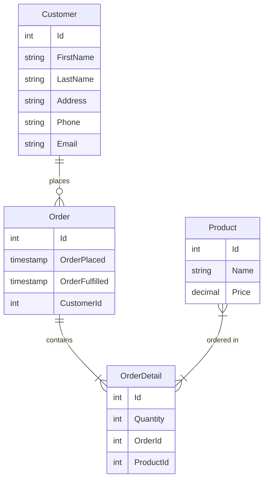

# ContosoPizza

Demo app for Entity Framework Core

```mermaid
erDiagram
    Customer { 
        int Id
        string FirstName
        string LastName
        string Address
        string Phone
        string Email
    }
    
    Order {
        int Id
        timestamp OrderPlaced
        timestamp OrderFulfilled
        int CustomerId
    }
    
    Product {
        int Id
        string Name
        decimal Price
    }
    
    OrderDetail {
        int Id
        int Quantity
        int OrderId
        int ProductId
    }

    Customer ||--o{ Order : places
    Order ||--|{ OrderDetail : contains
    Product }|--|{ OrderDetail : "ordered in"

```